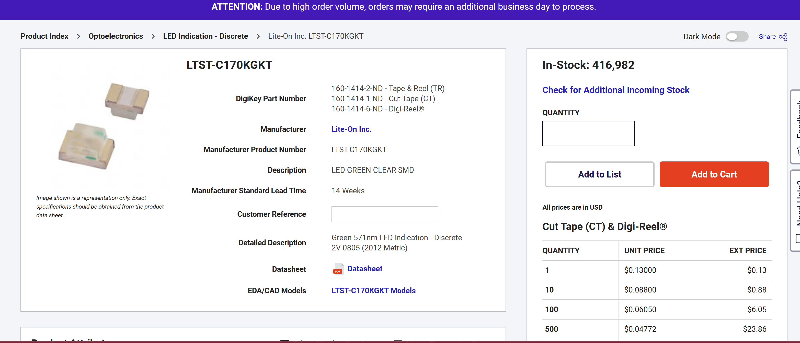
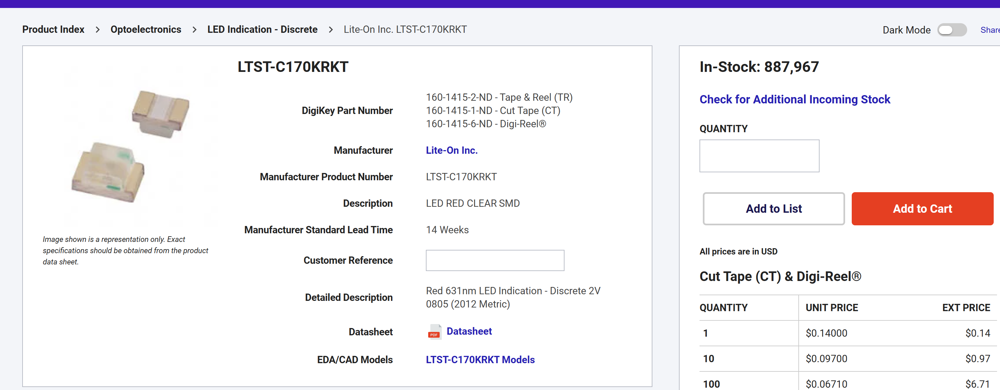
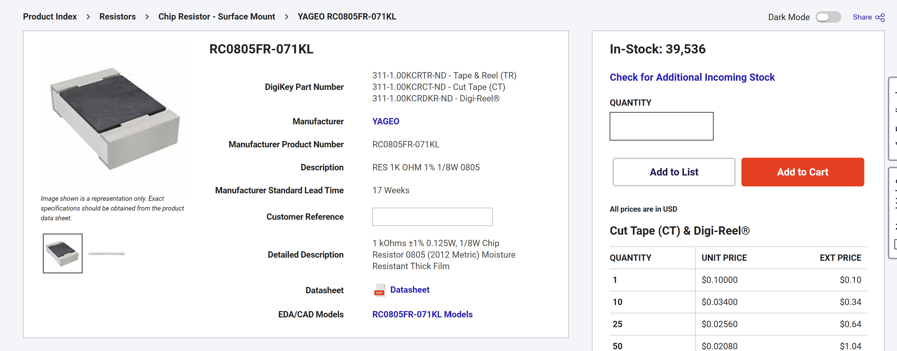

# Design Notes

### Component Selection
- MCU = ATMEGA328PB-AU
  - worked with MCU before
  - cheap
  - I2C capabilities for sensor communication
  - UART abilities
  - AU = 32 pins = easier to solder by hand
 

 
- Sensor= BME280
  - measures temp, humidity, pressure
  - popular
  - I2C, therefore can communicate with ATmega328PB
 

- Regulator = MIC5504-3.3YM5-TR
  - 3.3V LDO
  - SOT23-5 (easier for soldering)
  - 300 mA
  - cheap

   
- 2 LEDS
  - D1 for power
    - Green LED
    
    - close to the regulator output (3.3 V rail), not directly on USB 5 V to ensure that regulator is working and correctly supplying a 3.3 V rail

  - D2 for status/heartbeat
    - Red LED
    

  - 1k resistors for both LEDs
    
    - allows for enough current for visibility, but saves power
    - 3.3 V supply after regulator, drops 2 V across LED, leaves 1.3 V for resistor
    - desired current above 1mA for visibility, 1.3 mA for nice number and easier visibility
    - Ohm's Law: R = V/I = 1.3/1.3 mA = 1k resistor

